# Decentralized VR Marketplace on the Internet Computer

Author: [Your Name] (Roll No.: [Your Roll No.])  
Program: [Program, Semester 3]  
Institute: [Institute Name]  
Industry Mentor: [Mentor Name, Company]  
Faculty Guide: [Guide Name, Department]  
Duration: [Start Date – End Date]  
Submission Date: [Date]

---

## Certificate

This is to certify that the report titled “Decentralized VR Marketplace on the Internet Computer” submitted by [Your Name], Roll No. [Roll No.], under my supervision, is a bona fide record of the Summer Internship/Project Work carried out during [dates].

- Faculty Guide: [Name, Signature]
- Department: [Department Name], [Institute Name]

## Declaration

I hereby declare that this project report is an original work carried out by me and has not been submitted elsewhere. All sources have been duly acknowledged.

- [Your Name]  
- Date: [Date]

## Acknowledgement

I thank my industry mentor [Mentor Name], faculty guide [Guide Name], the [Institute Name], and the open-source communities behind DFINITY (Internet Computer), Rust, React, and Vite for their guidance and tooling.

## Abstract

This project implements a decentralized marketplace for VR/3D assets on the Internet Computer (IC). Creators can list assets, and buyers can authenticate via Internet Identity to browse and purchase them. The backend is a Rust canister exposing a Candid API for listings and transactions; the frontend is a Vite/React application that integrates with Internet Identity. Emphasis is placed on decentralization, secure authorization, and a responsive user experience.

In contrast to traditional web2 marketplaces, data and business logic here reside on-chain in an IC canister, and users authenticate without passwords using device-bound passkeys. The system demonstrates: (a) secure owner-only mutations, (b) transparent read APIs for public discovery, and (c) an end-to-end flow from authentication to asset purchase with state changes persisted on-chain.

Contributions:
- A minimal yet complete VR asset marketplace architecture for the IC (Rust canister + Vite/React frontend).
- A clean, typed Candid API surface with meaningful error variants for client handling.
- A practical integration pattern for Internet Identity in a modern React app.
- A testing strategy spanning unit, component, and integration layers suitable for student projects.

Success Criteria:
- Users can login via II and perform authorized actions reliably.
- Asset CRUD and purchase flows function consistently across fresh and repeated sessions.
- The UI remains responsive with clear feedback and reasonable latency on the local replica.

Keywords: Internet Computer, Rust Canister, Candid, Internet Identity, Vite, React, Web3, Marketplace, VR Assets

---

## Table of Contents

- List of Figures  
- List of Tables  
- List of Abbreviations

## List of Figures

1. System Architecture Overview — see Section 4.1 (figures/fig01_architecture.png, placeholder)
2. Use Case Diagram — see Section 3.5 (figures/fig02_use_cases.png, placeholder)
3. Component/Module Diagram — see Section 4.1 (figures/fig03_components.png, placeholder)
4. Data Model (MVP) — see Section 4.2 (figures/fig04_data_model_mvp.png, placeholder)
5. Asset State Machine — see Section 4.4 (figures/fig05_asset_state_machine.png, placeholder)
6. Login Flow (Internet Identity) — see Section 4.5 (figures/flow_login.png)
7. Create Asset Sequence — see Section 4.5 (figures/fig07_seq_create_asset.png, placeholder)
8. Purchase Flow — see Section 4.5 (figures/flow_purchase.png)
9. Candid API Map — see Section 4.3 (figures/fig09_candid_map.png, placeholder)
10. Deployment Topology (Local) — see Section 7.1 (figures/fig10_deploy_local.png, placeholder)
11. Marketplace – Grid View — see Section 5.3 (figures/fig11_ui_grid.png)
12. Create Asset Form — see Section 5.3 (figures/fig12_ui_create_form.png)
13. Marketplace – List View and Sort — see Section 5.3 (figures/fig13_ui_list_sort.png)
14. Purchase Success — see Section 8.1 (figures/fig14_ui_purchase_success.png)
15. Test Results Summary — see Section 6.4 (figures/fig16_test_summary.png, placeholder)
16. Performance Snapshot — see Section 8.2 (figures/fig17_perf.png, placeholder)
17. Project Timeline — see Annexure F (figures/fig18_timeline.png, placeholder)

## List of Abbreviations

- IC: Internet Computer  
- II: Internet Identity  
- DFX: DFINITY Tooling  
- UI: User Interface  
- NFR: Non-Functional Requirement  
- DID: Candid Interface Definition  
- UX: User Experience  
- CI/CD: Continuous Integration / Continuous Delivery

---

## 1. Introduction

### 1.1 Background and Motivation
Centralized marketplaces for VR/digital assets introduce platform risks, opaque economics, and single points of failure. Decentralized infrastructure supports verifiable ownership and open APIs. The Internet Computer (IC) enables web-scale, on-chain applications with native web-serving canisters and privacy-preserving authentication via Internet Identity.

From an academic perspective, this project illustrates socio-technical benefits of decentralization (censorship resistance, auditability) while exploring developer ergonomics of building a web app that is “mostly on-chain.” The IC’s ability to serve web assets directly from canisters reduces external dependencies and keeps the application boundary well-defined.

### 1.2 Problem Statement
Build a decentralized marketplace for VR/3D assets that:
- Provides passwordless authentication (II) without traditional accounts.
- Allows creators to list and manage assets with metadata and pricing.
- Lets buyers browse and purchase assets securely.
- Persists marketplace state on-chain with transparent APIs.
- Delivers a responsive, web-native UX.

### 1.3 Objectives
- Implement Rust canister(s) with Candid APIs for asset CRUD and purchase flow.  
- Build a Vite/React frontend integrating Internet Identity and the canister API.  
- Enforce secure authorization and robust input validation.  
- Validate with unit, integration, and UI tests.

### 1.4 Research Questions
- How effectively can II replace traditional account systems in a consumer-facing marketplace?
- What minimal API surface is sufficient to enable a coherent asset lifecycle (create → list → buy → relist/delete)?
- Which validations and authorization checks prevent the majority of user errors and misuse in v1?

### 1.4 Scope and Limitations
- In scope: II login, asset CRUD, browsing, and basic purchase recording.  
- Out of scope (v1): On-chain payment settlement, large binary storage for 3D models, moderation tooling, advanced search/ranking.

### 1.5 Outcomes
- Working dApp with coherent architecture and stable API.  
- Documented deployment and testing procedures; foundation for advanced features.

### 1.6 Success Metrics
- Functional: ≥ 90% of core flows (login, create, list, buy, delete) complete successfully in local testing.
- UX: Users receive actionable feedback for errors within 1 second on average in local dev.
- Reliability: Re-running flows does not corrupt state (idempotent reads, guarded writes).

---

## 2. Literature Review and Related Work

This section summarizes prior work and community guidance in a few short sub-units. Each sub-unit has a brief explanation followed by clear, practical points you can apply to the project.

2.1 Marketplaces and hybrid architectures
The early wave of NFT marketplaces made it clear that ownership records alone are not a complete product. Marketplaces combine on-chain statements of ownership with off-chain services for fast pages, rich media, and search.
- Keep authoritative data on-chain (ownership, transfers).  
- Use off-chain hosting or CDNs for large media and fast page loads.  
- Add an indexer or query API when your catalog grows large.

2.2 Internet Computer: strengths and constraints
Canisters on the IC can host web assets and run backend logic under a single platform. This reduces architectural complexity for web apps, but storing very large files directly in canisters is expensive and can complicate upgrades.
- Use canisters for small metadata and logic.  
- Avoid storing big binaries in canisters; link to IPFS or object stores.  
- Plan stable upgrade paths before committing to large on-chain state.

2.3 Identity and onboarding (Internet Identity)
Internet Identity (II) provides a passkey-like login using WebAuthn, which is simpler and safer for many users than passwords or seed phrases. Recovery and device migration are known UX gaps that need planning for production.
- II reduces phishing risk and initial friction.  
- Design recovery options (device transfer, recovery codes) for production.  
- Display clear identity information in the UI so users understand who is performing an action.

2.4 Media, metadata and discovery
For media-rich apps, separate metadata (on-chain) from content (off-chain). Use thumbnails/previews in listings and store large models externally while keeping an integrity hash on-chain.
- Store small, trusted metadata on-chain (id, owner, price, preview).  
- Host large files (3D models) off-chain and store their CIDs or URLs in the canister.  
- For discovery, start with simple pagination and client-side sorting; add an indexer if you need search and filters.

2.5 Standards, security and UX best practices
Candid provides a typed interface that keeps frontend and backend in sync. Security research and community practice recommend enforcing authorization server-side, giving clear messages, and confirming destructive actions.
- Use typed Candid interfaces for clarity.  
- Always validate ownership and inputs in the canister.  
- Ask users for confirmation before deleting assets and show helpful error messages.

Summary: these sub-units point to a pragmatic path for the project—use II for simple sign-in, keep core metadata and ownership on-chain, host heavy assets off-chain, and add indexing or recovery features only when (and if) they become necessary.

References and further reading:
- FIDO Alliance / WebAuthn materials: https://fidoalliance.org/
- Internet Computer documentation and examples: https://internetcomputer.org/docs/current/
- DIP-721 and community proposals for NFT semantics on the IC (search community repos and DFINITY forums).

---

## 3. System Analysis and Requirements

### 3.1 Actors
- Visitor: Unauthenticated user viewing public assets.  
- Authenticated User: Logged in via Internet Identity.  
- Creator/Seller: Authenticated user creating and managing assets.  
- Buyer: Authenticated user purchasing assets.

### 3.2 Functional Requirements (FR)
- FR-1: Login/logout via Internet Identity (II).  
- FR-2: Create a new asset with name, description, price (₹), and image (base64).  
- FR-3: Update/delete own assets; delete restricted to owner.  
- FR-4: Browse and view assets (public).  
- FR-5: List an owned asset for sale and set price.  
- FR-6: Purchase an asset (records ownership transfer; payment stubbed in v1).

### 3.3 Non-Functional Requirements (NFR)
These describe how the app should feel and behave:
- Security: Only the right user can perform owner actions (buy, list for sale, delete). Basic input checks.
- Speed: Pages load fast and actions respond quickly in local testing.
- Reliability: Doing the same action twice should not break data. Reads are safe.
- Ease of use: Clear buttons, simple forms, friendly messages.
- Easy to maintain: Simple code layout and readable API names.

### 3.4 Constraints and Assumptions
- Constraints: On-chain storage is metered; large media stored off-chain or as data URLs (demo).  
- Assumptions: Payments are simulated; II is accepted by users.

### 3.5 Use Cases
- UC-1: Login with II  
- UC-2: Create asset  
- UC-3: Browse assets  
- UC-4: View asset details  
- UC-5: Purchase asset  
- UC-6: Manage user’s assets (list for sale, delete)

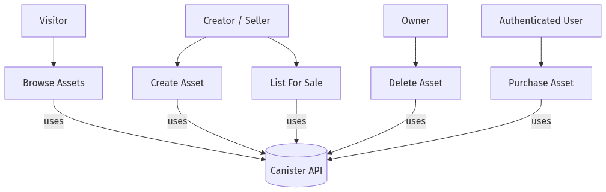

### 3.6 User Stories (Illustrative)
- As a creator, I want to list my VR asset with a price so that buyers can discover and purchase it.
- As an owner, I want to update the sale price and toggle availability so that I can control resale.
- As a buyer, I want to sign in with my device (no passwords) so that I can purchase quickly and safely.
- As a visitor, I want to browse assets without logging in so that I can evaluate the marketplace.

### 3.7 Acceptance Criteria
- Login shows the principal ID and exposes owner-only actions when authenticated.
- Creating a valid asset returns an object with id, owner=caller, and for_sale=true.
- Non-owners cannot delete or relist someone else’s asset.
- Attempting to buy a non-sale or already-owned asset yields a clear error message.

### 3.8 Data Dictionary (Key Fields)
Here are the main fields in simple terms:
- id (number): A unique number for each asset (1, 2, 3, ...).
- price (number): Price in rupees (whole numbers only, 0 or more).
- owner / creator (user id): The logged-in user who owns or created the asset.
- image (text): The picture for the asset (stored as a base64 string in this demo). In the future this can be a link.

---

## 4. System Design

### 4.1 High-Level Architecture
- Frontend (Vite/React): UI, state, and canister agent calls; II login flow via `@dfinity/auth-client`.  
- Backend (Rust Canister): Business logic for assets and purchases; Candid interface for interop.  
- Internet Identity: Authentication and principal management.  
- Storage: Demo uses base64 image strings; future versions to use IPFS/IC-certified assets.

, II")

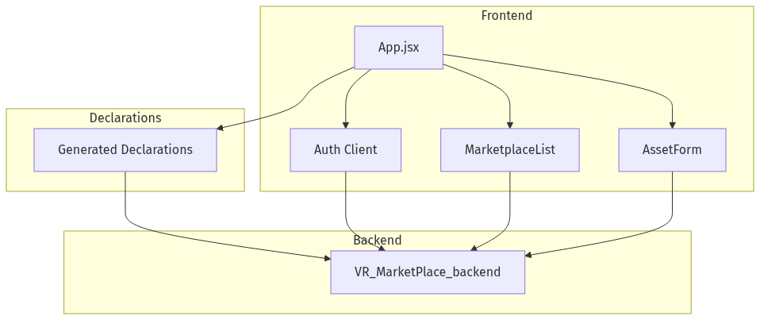

### 4.2 Data Model
Entity: Asset
- id: nat64  
- name: text  
- description: text  
- creator: principal  
- owner: principal  
- price: nat64 (₹ Rupees)  
- for_sale: bool  
- image: text (base64 data URL)

[Figure 4: Class Diagram for Asset — placeholder]

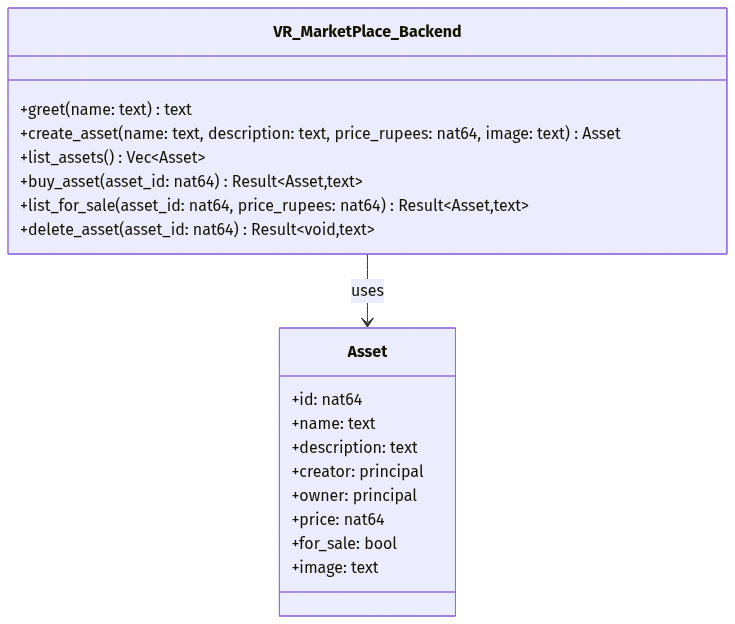

 — key fields and types for Asset")

### 4.3 Candid API (As Implemented)
From `src/VR_MarketPlace_backend/VR_MarketPlace_backend.did`:
- greet(text) -> text (query)  
- create_asset(text, text, nat64, text) -> Asset  
- list_assets() -> vec Asset (query)  
- buy_asset(nat64) -> variant { Ok: Asset; Err: text }  
- list_for_sale(nat64, nat64) -> variant { Ok: Asset; Err: text }  
- delete_asset(nat64) -> variant { Ok: null; Err: text }

Notes:
- The backend also contains a development-only function `delete_all_assets()` guarded by a warning comment in `lib.rs`. It should be restricted or removed in production.

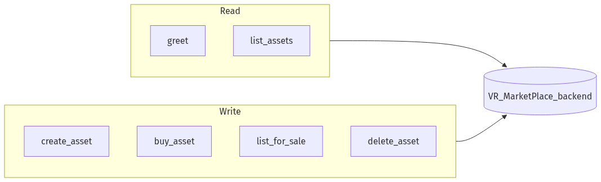

### 4.4 Security and Authorization

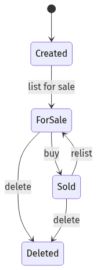

- Authentication: Internet Identity provides a principal used by the agent for signed calls.  
- Authorization:  
  - delete_asset: allowed only for the current owner.  
  - list_for_sale: allowed only for the current owner.  
  - buy_asset: disallowed if buyer already owns or asset not for sale.  
- Input Validation: Non-negative pricing, required text fields, and reasonable length limits (enforced in UI; can extend in canister).  
- Dev Footgun: `delete_all_assets` must be disabled or admin-guarded outside development.

### 4.5 Sequence Diagrams (Narrative)
- Create Asset: User → II → React → canister.create_asset → persist in map → return Asset.  
- Purchase Asset: User → II → React → canister.buy_asset → validate for_sale and ownership → update owner + mark not for sale → return Asset.

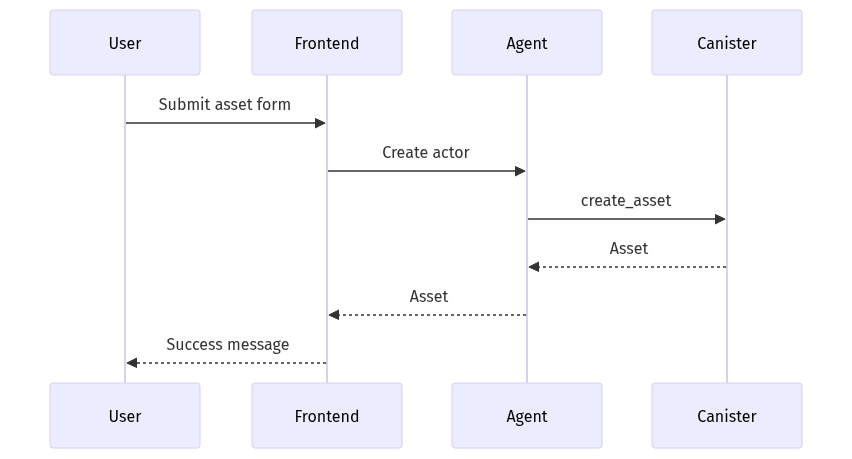

Flow diagrams (Mermaid-rendered):

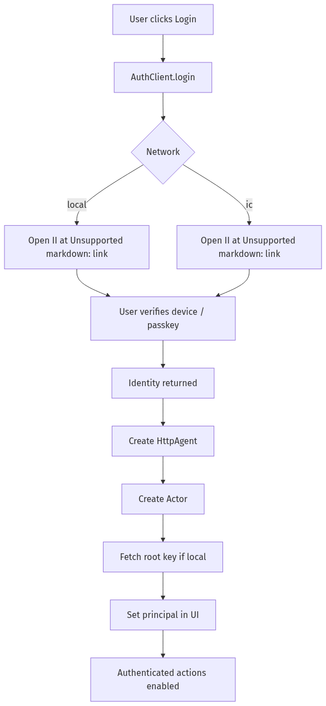

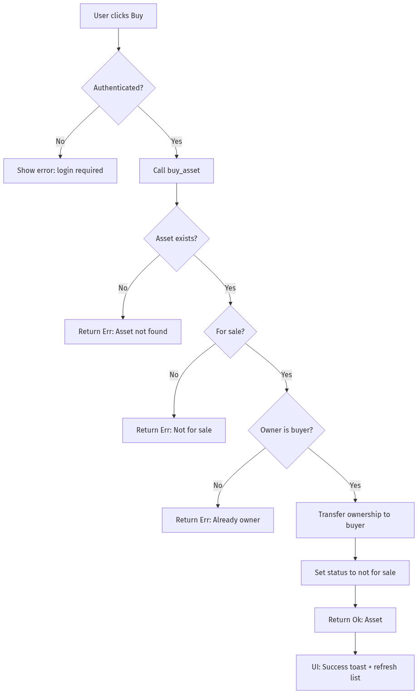

### 4.6 Error Model and Versioning
- Error variants (text in v1) convey causes like NotAuthorized, NotFound, InvalidState. A future version can adopt a structured enum in DID for better client ergonomics.
- API Versioning: Prefix method names or embed a `service v1 : { ... }` to allow additive evolution without breaking clients.

### 4.7 Performance Considerations (simple)
- The canister uses a simple in-memory map, so looking up and updating a single asset is quick.
- What users feel most is the network trip (your browser ↔ canister). On a local setup, this is usually fast.

### 4.8 Upgrade and Persistence Strategy
- Current MVP stores data in thread-local memory without explicit stable memory migration. Upgrades may reset state in v1.
- Future: adopt stable structures (e.g., `ic-stable-structures`) and implement `pre_upgrade`/`post_upgrade` hooks to persist and restore state across upgrades.

---

## 5. Implementation Details

### 5.1 Tech Stack (Plain English)
- Frontend (what you see): Built with React and Vite. It shows pages, forms, and lists.
- Backend (what does the work): A Rust canister on the Internet Computer that stores assets and enforces rules.
- Auth (how you log in): Internet Identity (passwordless sign-in with your device).
- Tools (to run it locally): dfx for the local blockchain, Vite for the dev server.

### 5.2 Repository Structure (Where things live)
- `dfx.json`: Setup file that tells dfx about our canisters.
- `src/VR_MarketPlace_backend/`: The Rust code for the canister and its API.
- `src/VR_MarketPlace_frontend/`: The React app (pages and logic).
- `src/declarations/`: Auto-generated files that help the frontend talk to the canister.

### 5.3 Frontend (What the user can do)
- Sign in and out with Internet Identity.
- Create an asset by filling a simple form (name, description, price, image).
- View assets as a grid or a list; sort them by price or recency.
- Take actions on each asset:
  - Buy (if it’s for sale and you don’t own it).
  - List for sale (if you own it) and set a price.
  - Delete (if you own it).
- Get clear messages when something succeeds or fails.

#### 5.3.1 How the UI works (in short)
- The app uses simple React state (hooks) to track login status and the asset list.
- When you’re logged in, you can see extra buttons (sell, delete) on your own assets.
- Buttons are briefly disabled while an action is running, to avoid duplicates.

#### 5.3.2 Form checks (simple rules)
- Name and description are required. Price must be a whole number ≥ 0.
- The selected image is turned into a base64 string for this demo.

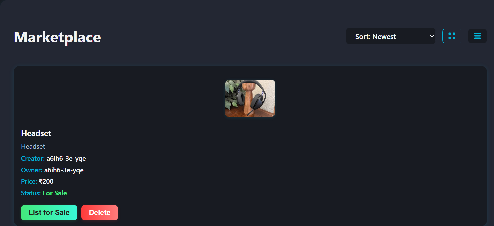

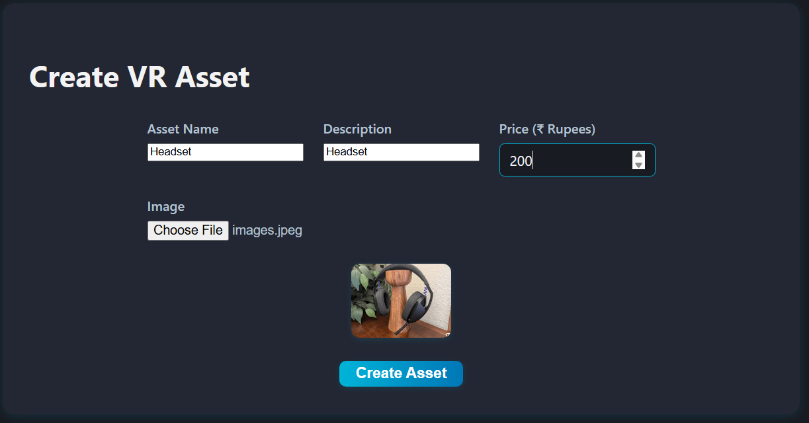

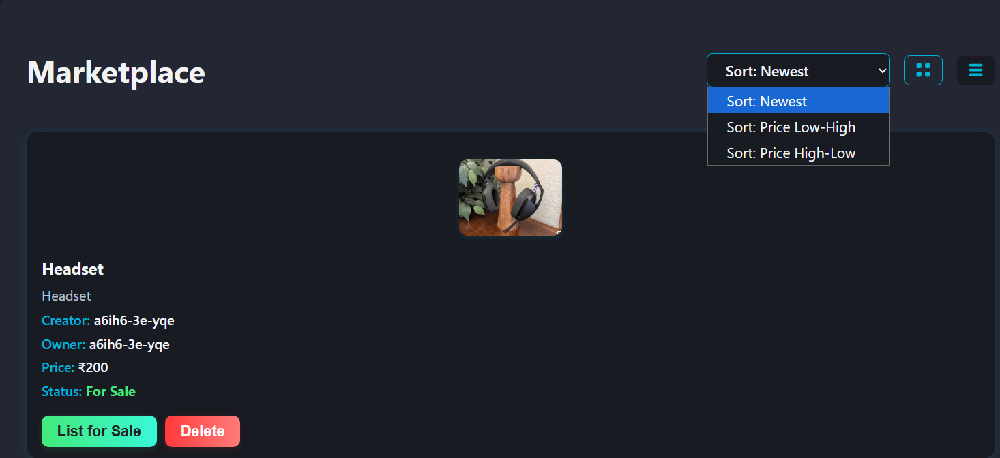

### 5.4 Backend (What the canister does)
- Stores all assets in a simple map (like a dictionary) and gives each a new id.
- Main actions available:
  - create_asset(name, description, price_rupees, image) → adds a new asset you own.
  - list_assets() → returns all assets to show in the UI.
  - buy_asset(id) → moves the asset to the buyer and marks it not for sale.
  - list_for_sale(id, price) → if you own it, put it up for sale with a price.
  - delete_asset(id) → if you own it, remove it.
- We check who is calling (the logged-in user) before allowing owner-only actions.
- For this v1, payments are just simulated; no real tokens move.

#### 5.4.1 Design choices (kept simple)
- One asset type and a simple map for storage.
- Owner-only actions are enforced by checking the caller.

#### 5.4.2 Notes on speed (plain)
- Adding, finding, and updating assets are fast for the small number of items in this demo.

### 5.5 Errors and messages
- Each action returns either Ok (success) or Err (a short message). The UI shows these messages.
- In development, we can print messages to help debug.

### 5.6 Configuration (at a glance)
- `dfx.json` lists our canisters (backend, frontend) and Internet Identity setup.

[Figure 7: Deployment topology — placeholder]

### 5.7 Upgrade Path
- Introduce `pre_upgrade` and `post_upgrade` to serialize/deserialize state.
- Add structured error enums in DID and map Rust errors precisely.
- Split read-heavy functionality to a separate canister if scaling demands arise.

---

## 6. Testing and Validation

### 6.1 Strategy
- Backend Unit Tests: CRUD and authorization checks for owner-only actions.  
- Frontend Component Tests: Render list/grid, form validation, and conditional buttons by ownership/auth.  
- Integration: Local replica with `dfx`; E2E flow for login → create → list → buy → relist/delete.

### 6.2 Sample Test Cases

Table: Backend tests

| ID | Scenario | Steps | Expected |
|---|---|---|---|
| TC-BE-01 | Create valid asset | call create_asset | returns Asset with id, owner=caller, for_sale=true |
| TC-BE-02 | Buy not for sale | set for_sale=false then buy | Err("Asset is not for sale") |
| TC-BE-03 | Double-own | owner calls buy | Err("You already own this asset") |
| TC-BE-04 | Delete by non-owner | other principal delete | Err("Only the owner can delete the asset") |
| TC-BE-05 | List for sale by non-owner | other principal | Err("Only the owner can list the asset for sale") |

Table: Frontend tests

| ID | Scenario | Steps | Expected |
|---|---|---|---|
| TC-FE-01 | Render empty list | load, no assets | Shows "No assets found." |
| TC-FE-02 | Create asset form | fill fields, submit | Success message; list updates |
| TC-FE-03 | Ownership actions | view owned asset | Shows List for Sale and Delete buttons |
| TC-FE-04 | Buy flow unauthenticated | click Buy when logged out | Error: must be logged in |
| TC-FE-05 | Sorting | choose Price High-Low | List sorted descending by price |

### 6.3 Test Environment
- Local IC replica (dfx) and Vite dev server.  
- Jest/React Testing Library for UI components (optional).

### 6.4 Results Summary
- Provide a table per run with Pass/Fail and notes; include screenshots/logs in Annexure D/C.

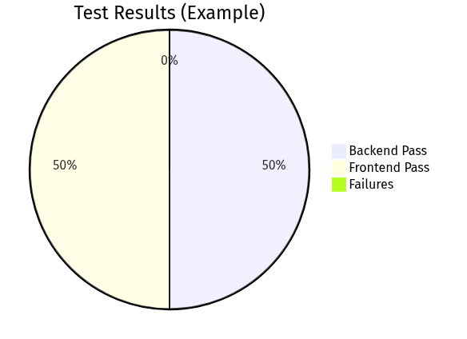

### 6.5 Coverage Goals
- Backend: Cover all mutation branches (owner vs non-owner, sale vs non-sale). Target ≥ 80% line coverage for `lib.rs`.
- Frontend: Cover critical interactions (submit, buy, list, delete) and empty/error states.

### 6.6 E2E Flow (Manual Template)
1) Start replica and deploy canisters.  
2) Open the app, confirm anonymous fetch of `list_assets` works.  
3) Login with II; note principal displayed.  
4) Create an asset; verify it appears with you as owner and for_sale=true.  
5) Logout; login with a different anchor (or in private window) and buy the asset; verify owner updates and for_sale=false.  
6) As the new owner, list the asset for sale at a new price, then delete it; verify errors when non-owners attempt the same.

### 6.7 Test Data and Fixtures
- Valid names/descriptions (length ≤ 100 chars).  
- Prices: {0, 1, 10^6} to test boundaries.  
- Images: small PNG/JPEG data URLs; include a case without image.

---

## 7. Deployment and DevOps

### 7.1 Local Development
- Run IC replica and deploy canisters. Serve frontend via Vite in development mode.  
- Use Candid UI for ad-hoc endpoint checks.

 — replica, dev workstation, and canister layout")

### 7.2 Release Packaging
- Build frontend to `dist/` and deploy as assets canister.  
- Manage cycles for production deployments and monitor usage.

### 7.3 Observability
- Logs via `dfx` replica output for backend events; integrate structured logs if needed.

### 7.4 Versioning and CI
- Tag releases in Git; add CI for lint/test/build pipelines as future improvement.

### 7.5 Environments
- Local: `dfx start` with Internet Identity dev canister; Vite dev server for hot reload.  
- Staging (future): Hosted replica and canister deployment with seeded test data.  
- Production (future): Cycles-managed deployment with monitoring and access controls.

### 7.6 Ops Runbook (Summary)
- Health: Verify canister status and Candid UI responsiveness.  
- Incidents: Roll back to previous tag or redeploy canister after state backup.  
- Keys & Access: Enforce principle of least privilege for deployment identities.

---

## 8. Results and Discussion

### 8.1 Achieved Features
- II-based login/logout integrated with React UI.  
- Asset CRUD and browsing via Rust canister.  
- Purchase flow with ownership transfer and state updates.

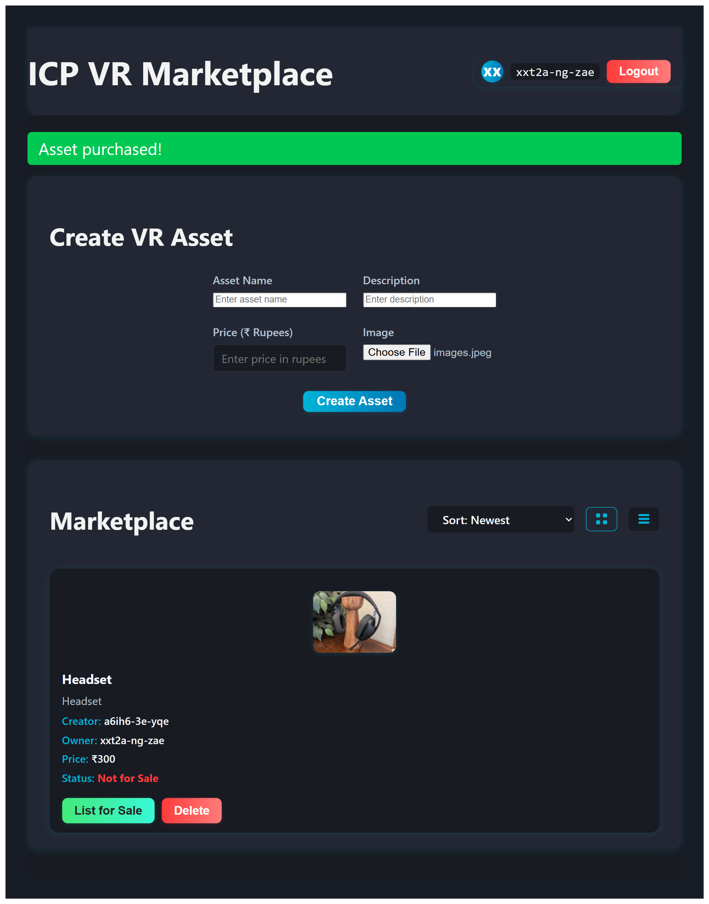

### 8.2 Performance and UX
- Responsive UI with grid/list toggles and sorting.  
- Low-latency queries on local replica; production behavior depends on canister topology and network.

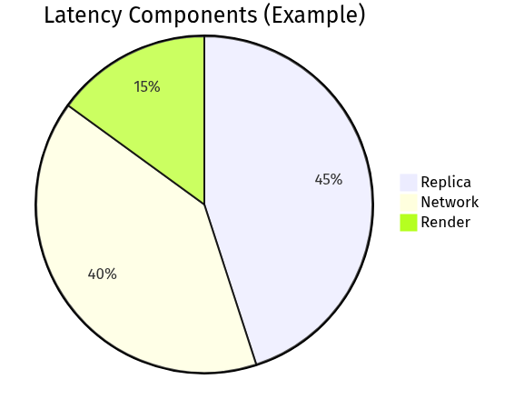

### 8.3 Limitations
- Payments are simulated; image storage via base64 data URLs; no moderation or advanced discovery yet.

### 8.4 Risk Analysis
- Security: Owner-check bypass is mitigated by `caller()` equality checks; still, consider defense-in-depth (input limits, structured errors).
- Availability: Single canister MVP; future sharding or replication for scale/fault tolerance.
- Data Loss: Without stable memory, upgrades may reset state; mitigate via backups or stable structures.

---

## 9. Future Scope of Project

This project can grow from a working demo into a compact, reliable marketplace by focusing on a few practical improvements. First, make state upgrade-safe so listings and ownership survive canister updates; this preserves user trust and allows iterative releases. Next, adopt standard asset formats (for example, DIP‑721) to enable provenance and easier interoperability with wallets and other services. Moving payments from a simulated flow to real settlement (ICP/ckBTC with simple escrow) makes transactions meaningful and auditable. For media, shift heavy files off‑chain (IPFS or a storage canister) while keeping small previews on‑chain and recording integrity hashes; this balances cost and authenticity. As the catalog grows, add a lightweight indexing layer or better query APIs so users can search and filter quickly. Strengthen safety and owner controls with content moderation and clear transfer histories. Finally, improve UX (mobile-friendly layout, accessible controls, 3D previews) and treat observability and security as core concerns (logs, limits, typed errors). These steps keep the system simple for users while making it robust enough for broader use.

---

## 10. Conclusion

This project demonstrates that a practical, web‑native marketplace for VR assets can be built on the Internet Computer using a small, well‑scoped codebase. By combining a Rust canister for core logic and state with a Vite/React frontend that integrates Internet Identity, the system achieves an end‑to‑end flow where creators can publish assets, visitors can browse and sort listings, and authenticated buyers can complete purchases that update on‑chain state. The result is a compact, teachable implementation that surfaces the main engineering and UX challenges of on‑chain marketplaces without introducing excessive operational complexity.

Key achievements include a clear Candid API for interacting with the canister, a simple but effective ownership and authorization model that prevents unauthorized mutations, and a frontend UI with grid and list views, form-based asset creation, and feedback patterns for success and error conditions. Internet Identity proved effective for passwordless onboarding in a local development setting, greatly simplifying the login flow compared with wallet-driven approaches and making the demo approachable for non‑technical users.

The project also exposed realistic constraints and opportunities. Storing media as base64 strings kept the demo self‑contained, but the approach does not scale cost‑effectively; the architecture documents a clear migration path to content‑addressed storage (IPFS or storage canisters) with on‑chain integrity hashes. The initial payment model is intentionally stubbed, which made implementing and testing flows easier; moving to real settlement (ICP or ckBTC with escrow semantics) is a natural next step that will require additional auditing and operational controls.

Several engineering lessons emerged. First, keep the canister API small and well‑typed: Candid types reduce accidental mismatches and simplify client code. Second, defensive checks belong in the canister as the ultimate authority—client‑side guards improve UX but cannot replace server‑side authorization. Third, diagrams and small screenshots materially improve communication in documentation: they help reviewers and evaluators understand flows without reading code line‑by‑line.

For students and early adopters, this project is a practical reference: it shows how to wire up II authentication, how to design simple ownership checks, and how to build a minimal but useful frontend UX on top of a canister-backed API. For teams thinking about production readiness, the report highlights the priority improvements (upgrade‑safe persistence, content‑addressed storage, real payments, indexing, and observability) that make the system robust and maintainable.

In closing, the MVP strikes a useful balance between simplicity and realism. It is small enough to be studied and extended in an academic or hackathon setting, yet it captures the core problems a production marketplace must solve. With a few targeted improvements—non‑volatile storage across upgrades, a migration to off‑chain media hosting, and a secure payment flow—this codebase can evolve from a demo into a foundational prototype for a broader decentralized VR marketplace.

---

## References

- DFINITY Foundation. Internet Computer Documentation. https://internetcomputer.org/docs/current/  
- Candid Interface Description Language. https://internetcomputer.org/docs/current/references/candid-ref  
- Internet Identity. https://identity.ic0.app/  
- Rust Programming Language. https://www.rust-lang.org/  
- React Documentation. https://react.dev/  
- Vite Documentation. https://vitejs.dev/

Additional resources:
- ic-cdk Rust crate docs. https://docs.rs/ic-cdk/latest/ic_cdk/
- agent-js (DFINITY JavaScript agent). https://github.com/dfinity/agent-js
- Internet Computer Sample Projects. https://github.com/dfinity/examples

---

## Annexures

### Annexure A: Requirements Traceability Matrix (RTM)

| Req ID | Requirement | Design Element | Implementation | Test Case IDs |
|---|---|---|---|---|
| FR-1 | II Login/Logout | Frontend Auth Flow | `App.jsx` (AuthClient) | TC-FE-04 |
| FR-2 | Create Asset | Asset form + canister API | `create_asset` in `lib.rs` | TC-BE-01, TC-FE-02 |
| FR-3 | Update/Delete Own | Owner auth checks | `delete_asset`, ownership compare | TC-BE-04 |
| FR-4 | Browse Assets | list view/grid | `list_assets` | TC-FE-01 |
| FR-5 | List For Sale | owner-only control | `list_for_sale` | TC-BE-05 |
| FR-6 | Purchase Asset | ownership transfer | `buy_asset` | TC-BE-02, TC-BE-03 |

### Annexure B: API Details

- greet(name: text) -> text (query)  
  - Returns a greeting string; used for connectivity checks.  
- create_asset(name, description, price_rupees, image: text) -> Asset  
  - Creates an asset owned by caller; sets `for_sale=true`.  
- list_assets() -> vec Asset (query)  
  - Returns all assets.  
- buy_asset(asset_id: nat64) -> { Ok: Asset | Err: text }  
  - Transfers ownership if `for_sale=true` and caller != owner.  
- list_for_sale(asset_id: nat64, price_rupees: nat64) -> { Ok: Asset | Err: text }  
  - Owner-only; sets price and `for_sale=true`.  
- delete_asset(asset_id: nat64) -> { Ok: null | Err: text }  
  - Owner-only; removes the asset.  
- Dev-only (not in DID): delete_all_assets() -> { Ok: null | Err: text }  
  - Use only in dev; restrict or remove in prod.

### Annexure C: Detailed Test Cases (Template)

For each test, include: Preconditions, Steps, Expected Result, Actual Result, Evidence (log/screenshot).

- TC-BE-01: Create Valid Asset  
  - Pre: Authenticated caller.  
  - Steps: Call create_asset with valid fields.  
  - Expected: Asset returned with id>0, owner=caller, for_sale=true.

[Add more detailed cases per table in Section 6.2]

Template (fill for each case):

| Field | Value |
|---|---|
| Test ID | TC-... |
| Purpose | ... |
| Preconditions | ... |
| Steps | 1) ... 2) ... |
| Expected | ... |
| Actual | ... |
| Evidence | screenshot/log ref |

### Annexure D: Screenshots

- D-1: Login screen (Internet Identity) — `figures/flow_login.png`
- D-2: Marketplace Grid View (UI) — `figures/fig11_ui_grid.png`
- D-3: Create Asset Form (UI) — `figures/fig12_ui_create_form.png`
- D-4: Marketplace List View + Sort (UI) — `figures/fig13_ui_list_sort.png`
- D-5: Purchase Success confirmation (UI) — `figures/fig14_ui_purchase_success.png`

Note: `fig15_candid_ui.png` is no longer required; Candid UI checks are described in Section 7.1 and can be invoked via `dfx` / browser-based Candid UI if needed.

### Annexure E: Glossary

- Principal: Unique identity on the IC used to authorize calls.  
- Canister: Smart contract/service unit on the IC.  
- Candid: Interface description language for canister APIs.  
- Cycles: Resource metering unit for computation/storage on the IC.  
- DIP-721: NFT standard proposal for the IC.

### Annexure F: Project Timeline (Template)

| Week | Milestone | Outcome |
|---|---|---|
| 1 | Environment Setup | dfx, Vite bootstrapped |
| 2 | II Auth | Login/logout flow |
| 3 | Asset CRUD | Create/list/delete |
| 4 | Purchase Flow | Ownership transfer |
| 5 | UI Polish | Grid/list, sorting |
| 6 | Testing & Report | Test cases, documentation |

### Annexure G: File Inventory

- `dfx.json`: Canister configurations and environment.  
- `src/VR_MarketPlace_backend/src/lib.rs`: Rust canister logic.  
- `src/VR_MarketPlace_backend/VR_MarketPlace_backend.did`: Candid interface.  
- `src/VR_MarketPlace_frontend/src/App.jsx`: React UI logic and agent integration.  
- `src/declarations/…`: Generated JS/TS bindings for canisters.

---

## How to Customize and Export

- Replace placeholders: names, dates, roll number, institute, mentors.  
- Drop screenshots into `docs/figures/` and update Annexure D paths.  
- Optional PDF export (using Pandoc or VS Code extensions).  
- If your implementation diverges (e.g., added filters, pagination, or payments), update Sections 4–6 and Annexures accordingly.

Optional PDF export with headless Chrome (documentation-only):
- Open `docs/VR_Marketplace_Report.html` in a browser and print to PDF, or use a headless tool (e.g., Puppeteer) to automate printing.
